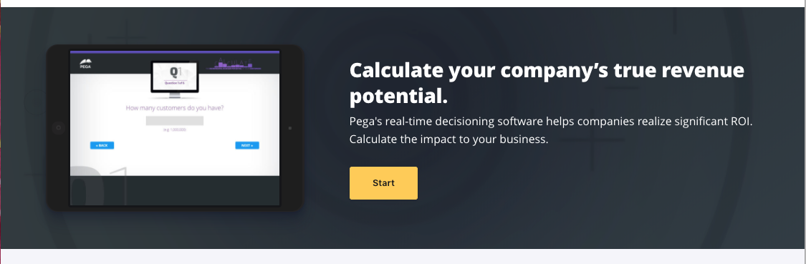
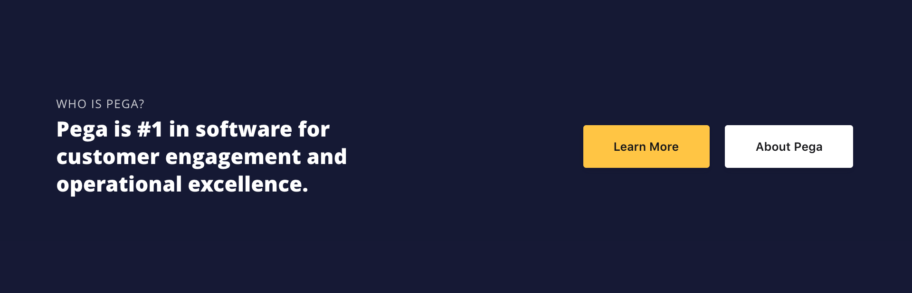

*For all band options and API docs, see the [Band reference in Pattern Lab](https://bolt-design-system.com/pattern-lab/?p=viewall-components-band).*

A band is a full width container that goes edge to edge on the display. Bands can contain multiple internal components, and help chunk related content together in a section of a page.

All band components can accept any of the color themes: `xdark,` `dark`, `light` and `xlight`. You can also add options such as background images, a texture, or an expandable video.

## Best Practices

### Use bands to group related information together

### Avoid "striping" 

### Focus on legibility

## Examples

Below are the most commonly used band types with examples.

### Collection Band

A collection band contains a series of teasers or cards, with the option to add images and links to resources, pages, etc. Use consistent content within teasers (eyebrows, similar headline lengths, etc.) to improve scannability.

<figure>

<figcaption>In a collection band, a trio of cards points users to more information about a topic.</figcaption>

</figure>

### Action Band

The action band includes a series of links associated with icons. Use an action band to point visitors to important sections of an experience, or to highlight specific categories of content. Limit action bands to 6 items to avoid wrapping to a second row on wider screens.

<figure>

<figcaption>The Action band provides instant links to high-level information.</figcaption>

</figure>

### Feature Band

The feature band provides the most flexible options for mixing content, interaction and images. It's best used in cases where you want to display blocks of content side by side, e.g. an image or video next to a teaser, or a list of assets next to a headline and teaser. 

<figure>

<figcaption>The simplest way to use a feature band is to display an image next to a teaser and CTA.</figcaption>

</figure>

<figure>

<figcaption>On product pages, feature bands are used to showcase zoomable product screenshots alongside teasers and CTAs.</figcaption>

</figure>

<figure>

<figcaption>In one of the more complex configurations, a video appears beside a UI list that features important links to further information.</figcaption>

</figure>

### Flag Band

The flag band contains for a brief, highly targeted message with a single call to action. Use a flag band to either create a distinct call to action within a page, or to add supplementary messaging to the elements above or below the band.

<figure>

<figcaption>The flag band is the most simple band configuration.</figcaption>

</figure>

### Index Band

Use an index band to group distinct sections of text-based content, such as teasers and headlines. Each index band can have a headline and teaser, along with 2 or more chunks of content. For optimal visual flow, ensure that the types of content you include are consistently constructed.q

### Lockup Band

A lockup band focuses content on a single, high-value message, with a number of supporting messages to the right of the main focal point. On page load, the primary message in the band switches, allowing each of the distinct content bundles in the lockup band to take center stage.

### Body Content Band

The body content band helps content authors create more robust content sections within a page. 