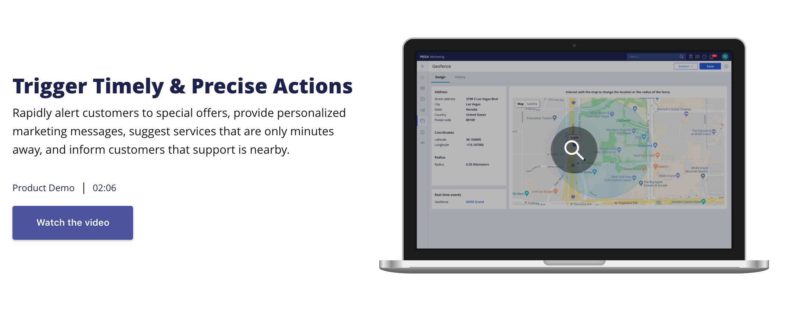
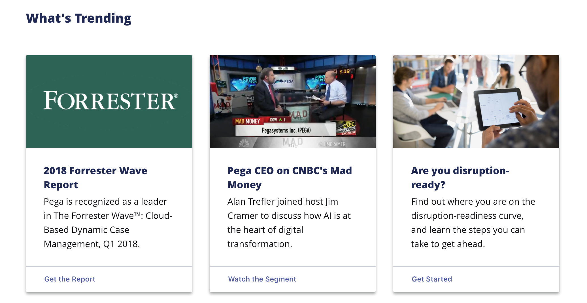

Buttons are used to provide a clear call to action. Their role is to provide immediate affordance for the next steps a user should take on a screen—whether it's to download a file, sign up for a demo, or save progress on a screen.

## Best Practices

A button's job is to give someone a clear next step to engage in. Here are some key things to keep in mind when using them in your work:

### Use clear and action-oriented labels

The label for a button should be concise, clear and action-oriented, e.g. "Save," "Sign Up," etc. Avoid unclear labels like "White Paper" or "Go."

### Stick to the color themes

In Bolt, buttons change in appearance based on the theme they're contained within. These themes were designed intentionally to maximize affordance, legibility and clarity. 

### Avoid overusing buttons

The best use for a button is at the end of a form, or in a prominent area of the page such as a hero band. Avoid using too many buttons; if you need to include two calls to action in a single band, use a button group instead. If you have multiple calls to action on a page (e.g. a bunch of cards), default to a text-link style instead.

## Examples

For complete examples of our buttons in action along with schema and API information, see the [button component](https://bolt-design-system.com/pattern-lab/?p=viewall-components-button) and [button group component](https://bolt-design-system.com/pattern-lab/?p=viewall-components-buttons-group) documentation in Pattern Lab. Below are some examples of common use cases for buttons.

### Buttons in bands

When placed in a band, buttons default to specific colors depending on the background of the band.

<figure>

<figcaption>In Dark and X-Dark bands, the primary button is in gold.</figcaption>
</figure>

<figure>

<figcaption>In Light and X-Light bands, the primary button is indigo.</figcaption>
</figure>

When two buttons exist in the same band, the second button is styled as a secondary action within a button group. 

<figure>

<figcaption>When two buttons are together in the same band, the secondary button is set in a different color to focus attention on the primary action.</figcaption>
</figure>

<figure>

<figcaption>When creating a layout that includes a number of calls to action, such as a trio of cards, use a text link instead to minimize cognitive overload.</figcaption>
</figure>