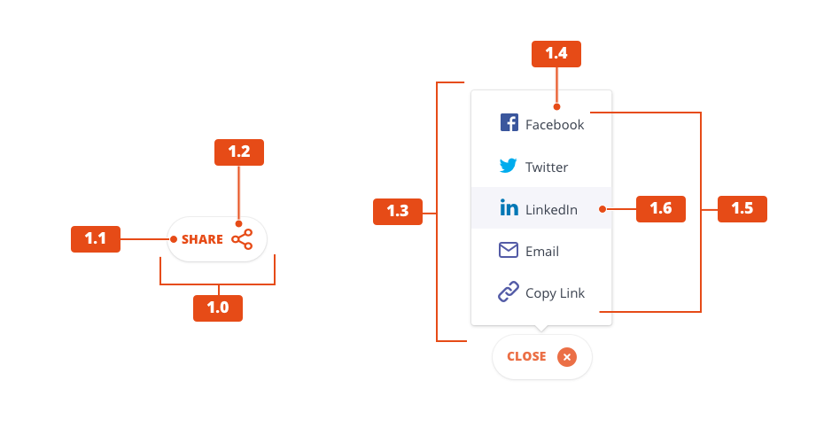

Our [reusable components](../pattern-lab/) provide flexible combinations of interface elements that enable designers and content authors to create web pages. Patterns are consistent combinations of components and elements that are frequently used across Pega websites.

## Anatomy of a pattern

A completed layout pattern consists of a few essential ingredients: 

- Core elements from our [visual language](/docs/visual-language/index.html), such as spacing, color or shadow;
- Layout components, such as images, text, etc.;
- Interaction components, as needed, such as animation or links;
- A wrapper to contain them, such as a card or a band.

These ingredients can be combined and shuffled in a variety of ways depending on your specific use case.

### Example: Share component

The share component 

<figure>

<figcaption>The sharing element allows visitors to post a piece of content across various social media options.</figcaption>
</figure>